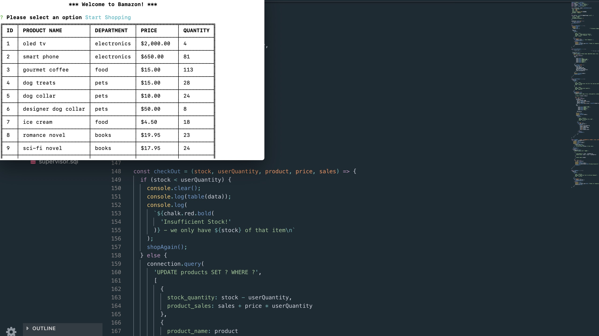

# Bamazon

Bamazon is a CLI storefront built with [Node.js](https://nodejs.org) & [MySQL](https://www.mysql.com/).

## Setting up Bamazon on your local machine

First, make sure you have a MySQL server instance running on your local machine. Use the provided `.sql` files to build the database. You will need to edit the `connection` variable in the `bamazonCustomer.js`, `bamazonManager.js`, & `bamazonSupervisor.js` files with your password. You may also need to change the `port` if `3306` is already in use.

Once your database is set up, navigate to the folder in your BASH/Terminal and run `npm i` to ensure you have the correct packages installed.

## Running Bamazon

The Bamazon package includes three files:

- `bamazonCustomer.js`
- `bamazonManager.js`
- `bamazonSupervisor.js`

### Customer View

[Watch on YouTube](https://youtu.be/4wMZ08lUm20)

Start by running `node bamazonCustomer`. The user is presented with the option to shop or exit Bamazon.

If the user chooses to shop, the program presents a table of items and asks the user to enter the ID of the product they wish to buy.

From there, the user enters the quantity they want. The user is then presented with a choice to go through with the transaction or decline. If the customer confirms the transaction, the quantity is removed from the database and the total price of the transaction is added to the database's `product_sales` column.

### Manager View

[Watch on YouTube](https://youtu.be/efkMYsagp4k)

Start by running `node bamazonManager`. The user is presented with a list of options:

- `View Products for Sale` - presents the same table as the customer view
- `View Low Inventory` - presents a table with all items whose inventory is less than five
- `Add to Inventory` - allows the user to add more stock to any item currently in the database
- `Add New Product` - allows the user to create a new item within any currently active department
- `Exit`

### Supervisor View

[Watch on YouTube](https://youtu.be/ytGQE_jOx7U)

Start by running `node bamazonSupervisor`. The user is presented with a list of options:

- `View Product Sales by Department` - presents a table with the overhead costs, total sales, and profit for each department
- `Create New Department` - allows the user to create a new department, which the manager can then use when adding a new product
- `Exit`

#### Known Issues

No current issues. Please report as you discover problems!

♥︎ cc
